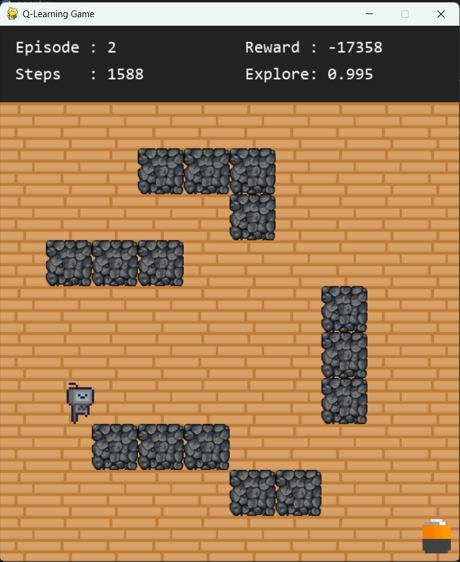

<div align="center">

# 🤖 RL Quest

### Teaching an AI Agent to Explore, Learn, and Succeed


<br>


</div>

## 🌲 About

RL Quest is a reinforcement learning playground built entirely from scratch using **Python** and **Pygame**.

Instead of hardcoding the solution, the robot learns through **trial and error** using the **Q-Learning algorithm**.

Watch the agent explore the environment, collide with obstacles, receive rewards, and eventually discover the optimal path completely on its own.

## ✨ Features

- 🤖 AI Agent powered by Q-Learning
- 🌲 Custom forest environment
- 🎮 Built with Pygame
- 🧠 Real-time learning
- 📊 Live training statistics
- 🎞 Animated robot
- 🪨 Obstacles and maze generation
- 🎯 Goal-based reward system


## 📸 Screenshots

### Current Gameplay

<p align="center">
  
</p>

### Learning Process

<p align="center">
  
</p>

### Forest Environment

<p align="center">
  
</p>

## 📂 Project Structure

```text
RL-Quest/
│
├── assets/
│   ├── grass/
│   ├── robot/
│   ├── wall/
│   └── goal/
│
├── game/
│   ├── agent.py
│   ├── animation.py
│   ├── draw.py
│   ├── qlearning.py
│   └── world.py
│
├── run.py
├── requirements.txt
├── README.md
└── LICENSE
```


# 🤖 RL Quest

(Banner)

(Badges)

Short introduction

---

# 📸 Screenshots

Image

Explain what the user is seeing.

Image

Explain what changed.

Image

Explain the learning progress.

---

# 🧠 How Does the AI Learn?

## The Problem

The robot starts with **zero knowledge**.

It doesn't know:

- where the goal is
- where the walls are
- which direction is correct

Its only ability is moving.

```
🌲 🌲 🌲 🌲

🤖

🏆
```

The robot is completely blind.

---

## Step 1 — Observe

The robot looks at its current position.

```
Current State

(0,0)
```

This is called the **State**.

---

## Step 2 — Think

The robot asks:

> "Which direction should I try?"

Possible actions:

```
↑ Up

↓

Down

← Left

→ Right
```

At the beginning...

It has absolutely no idea.

So it chooses randomly.

```
Right
```

---

## Step 3 — Environment Responds

The world reacts.

```
🤖 →

🌲
```

The robot hits a tree.

The environment returns:

```
Reward = -100
```

---

## Step 4 — Learn

The robot updates its memory.

Before:

```
State (0,0)

Right = 0
```

After:

```
State (0,0)

Right = -100
```

Now...

The robot has learned something.

---

## Step 5 — Try Again

Next episode.

```
State

(0,0)
```

Now maybe...

```
Down
```

Instead.

The world says

```
Reward = -1
```

Not amazing...

But better than hitting the tree.

---

## Step 6 — Eventually...

One day...

```
🤖 →

↓

↓

🏆
```

Reward

```
+100
```

The robot has finally discovered the goal.

---

# 🧠 Robot Memory

The robot remembers every experience.

Eventually its memory looks like this.

| State | Up | Down | Left | Right |
|-------|----:|----:|----:|----:|
|(0,0)|-8|5|-20|-100|
|(0,1)|2|8|-5|17|
|(0,2)|4|12|3|40|

This table is called the **Q-Table**.

The robot always chooses the action with the highest value.

Example:

```
Up      -8

Down     5

Left   -20

Right  17
```

The robot chooses

```
Right
```

because **17** is the best known decision.

---

# 🔄 The Learning Cycle

The robot repeats exactly the same process thousands of times.

```
Observe

↓

Choose Action

↓

Move

↓

Receive Reward

↓

Update Q-Table

↓

Repeat
```

After enough repetitions...

The random behavior slowly disappears.

The robot becomes better and better.

---

# 🎯 Exploration vs Exploitation

At first:

```
🤖

↓

Random

↓

Random

↓

Random
```

The robot explores.

Later:

```
🤖

↓

Best Move

↓

Best Move

↓

Best Move
```

The robot exploits what it has learned.

This balance is controlled by **epsilon (ε)**.

High epsilon

```
Explore
```

Low epsilon

```
Use experience
```

---

# 🏗 Project Architecture

```
RL Quest

│

├── run.py

│

├── game/

│   ├── world.py

│   ├── agent.py

│   ├── qlearning.py

│   ├── animation.py

│   └── draw.py

│

├── assets/

│

└── docs/
```

---

# 🔁 Game Loop

```
run.py

↓

Observe State

↓

Choose Action

↓

Move Agent

↓

Environment Calculates Reward

↓

Update Q-Table

↓

Render

↓

Repeat
```

---

# 📂 Project Structure

(project tree)

---

# ⚙ Installation

...

---

# 🚀 Run

...

---

# 📦 Requirements

...

---

# 🔮 Future Improvements

- Deep Q Learning (DQN)

- Multiple environments

- Procedural maze generation

- Heat map visualization

- Save / Load trained models

- Reward visualization

- Statistics dashboard

- TensorBoard support

- Multi-agent learning

- Policy Gradient

- PPO

- A*

- Genetic Algorithms

---

# ❤️ Why This Project Exists

This repository was built to demonstrate that intelligence does not come from hardcoded rules.

Instead, an intelligent behavior can emerge from a very simple idea:

**Take an action. Receive feedback. Remember the result. Repeat thousands of times.**

Everything from game-playing agents to autonomous robots follows this same principle.

## ⚙️ Installation

Clone the repository

```bash
git clone https://github.com/YOUR_USERNAME/RL-Quest.git
```

Move into the project

```bash
cd RL-Quest
```

Create a virtual environment

```bash
python -m venv .venv
```

Activate it

### Windows

```bash
.venv\Scripts\activate
```

### Linux / macOS

```bash
source .venv/bin/activate
```

Install dependencies

```bash
pip install -r requirements.txt
```

Run the project

```bash
python run.py
```

